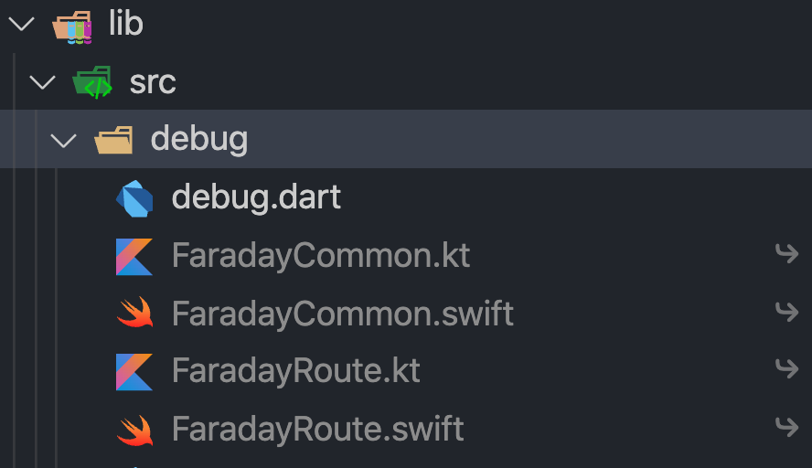

# Faraday_CLI


`faraday_cli`(以下简称`cli`)是配合[g_faraday](https://github.com/gfaraday/g_faraday)进行模块化混合应用开发的命令行程序,帮助我们减少部分重复性工作让开发更高效

## Features

- [x] Generate Common&Entry interface
- [x] Package iOS&Android framework/aar

## Why

### 桥接方法

进行混合应用开发通常会有以下需求。有一个功能在ios/android两端已经实现，在flutter层需要调用，这时候就需要在flutter层来定义接口，然后在两端分别实现。下面我们来看一段代码示例

``` dart

class EncryptUtils {

    // 加密
    static Future<String> encrypt(String content, Map<String, dynamic> options) {
        return FaradayCommon.invokeMethod('SomeFeature#encrypt', {'content': content, 'options': options});
    }

    // 解密
    static Future<String> decrypt(String encryptedContent, Map<String, dynamic> options) {
        return FaradayCommon.invokeMethod('SomeFeature#decrypt', {'encryptedContent': encryptedContent, 'options': options});
    }
}

```

以上，我们在flutter中定义了加密和解密2个方法，接下来我们需要分别在ios/android的`FaradayCommon`中来实现代码如下(仅swift，kotlin类似)

``` swift

func handle(_ name: String, _ arguments: Any?, _ completion: @escaping (_ result: Any?) -> Void) -> Void {
    if (name == "SomeFeature#encrypt") {
        guard let content = args?["content"] as? String else {
                fatalError("Invalid argument: content")
        }
        let options = args?["options"] as? [String, Any]

        // 使用以上参数来调用原生加密方法
    } else if (name = "SomeFeature#decrypt") {
        guard let encryptedContent = args?["encryptedContent"] as? String else {
                fatalError("Invalid argument: encryptedContent")
        }
        let options = args?["options"] as? [String, Any]

        // 使用以上参数来调用原生解密方法
    }
    ...
}

```

仔细看上述代码实现就会发现有很多重复代码片段，因此`cli`提供了对应的生成工具来实现代码生。(具体命令请见下述示例)

### 路由注册

flutter中一个典型的路由注册如下

```dart
// flutter
Map<String, RouteFactory> routes = {
    'first_page': (RouteSettings settings) => CupertinoPageRoute(
        builder: (context) => FirstPage(0), settings: settings),
    'home': (RouteSettings settings) => CupertinoPageRoute(
        builder: (context) => HomePage(settings.arguments), settings: settings),
    'flutter_tab_2': (RouteSettings settings) => CupertinoPageRoute(
        builder: (context) => HomePage(settings.arguments), settings: settings),
    'flutter_tab_1': (RouteSettings settings) => CupertinoPageRoute(
        builder: (context) => EmbeddingPage(0), settings: settings),
  };
```

``` swift

// swift

enum FaradayRoute {
    // ---> enum
    // ---> enum MainTabPage
    case first_page
    case home(Int id)
    case flutter_tab_2(String name)
    case flutter_tab_1
}
```

上面的例子可以看出我们在3端需要定义很多`常量字符串`,如果任由开发者手动输入，ide没有任何提醒，那会非常容易出错。(具体命令下述会有相关示例)

### 打包集成

#### ios

[官方集成方案](https://flutter.dev/docs/development/add-to-app/ios/project-setup)一共有3种，其中2中需要ios开发者本地由flutter开发环境，还有一种需要获取被人打包好的framework。这种开发体验对一个稍具规模的ios开发团队来说并不是特别友好。我们将采用 `pod 私有库`的方式在团队成员之间共享打包产物。同时对CI/CD流程提供支持

#### android

[android 官方方案](https://flutter.dev/docs/development/add-to-app/android/project-setup)对比ios来说，使用aar方式集成非常友好，只需要将编译产物放到大家都可以访问到的地址即可

## How

### 前置准备条件

- 安装`faraday cli`

``` shell

pub global active faraday

# print version
faraday version

```

- 准备文件服务器

为了无感集成flutter模块至现有的ios和android工程，需要一个所有团队成员均可访问的文件服务器(支持文件上传下载)来存储编译产物(`ios`为`cocoapods framework`，`android` 为`maven`仓库)
> 如果暂时没有文件服务器可以下载 [simple-http-server.py](tools/http-server/simple-http-server.py)启动一个用于测试的文件服务器。需要安装`python3`

- cocoapods private spec

ios选择使用`cocoapods`来集成，为了让native开的同学无感我们需要创建私有`repo`。
具体步骤参见 [Private Pods](https://guides.cocoapods.org/making/private-cocoapods.html)

### 配置文件

- *ios native* 项目中添加2个空文件

> 新建2个空文件用来生成 桥接方法和路由 的模版代码，建议文件名 FaradayCommon.swift、FaradayRoute.swift

- *android native* 项目中添加2个空文件

> 建议文件名 FaradayCommon.kt、FaradayRoute.kt

- *flutter module* 项目根目录下创建`.faraday.json`文件

`cli`主要作用就是为ios和android生成模版代码，所以在一切工作开始之前我们需先告诉`cli`相应文件的具体位置。

``` json
{
  "ios-common": "/path/to/FaradayCommon.swift", // 上面2步新建的文件路径
  "ios-route": "/path/to/FaradayRoute.swift",
  "android-common": "/path/to/FaradayCommon.kt",
  "android-route": "/path/to/FaradayRoute.kt"
}

```

> 版本控制工具请忽略此文件
> 每个开发者的 `.faraday.json` 文件都需要根据自己的需要配置添加

- `pubspec.yaml`

修改`flutter module`项目下的`pubspec.yaml`文件， 添加以下配置

``` yaml

...

version: 0.2.1-dev.0

####################################################
faraday:
  static_file_server_address: "http://localhost:8000" # 前置条件中的静态文件服务器
  pod_repo_name: "faraday" # 前置条件中的 private pod spec name
####################################################

environment:
  sdk: ">=2.9.0 <3.0.0"

...

```

### 初始化

``` shell

cd [your_flutter_module]

faraday init

```

初始化完成以后查看`lib/src/debug`目录



同时在`lib/src/`目录下会生成`routes.dart`文件，用来定义flutter侧的路由定义。如果一切正常说明初始化正常

### 集成

初始化完成以后，我们分别在3端来集成faraday

#### flutter

``` dart
import 'src/debug/debug.dart';
import 'src/routes.dart';

....

// debugMessage 每次打包都会更新称最新版本号，可以添加一个banner显示
debugPrint(debugMessage);

// 可以使用 CupertinoApp、MaterialApp、WidgetsApp 或者 Navigator 均可
CupertinoApp(onGenerateRoute: (_) => faraday.wrapper(routeFactory));

```

iOS端产物说明

- `protocol FaradayCommonHandler { }`

> 自动根据flutter端的common方法定义来生成接口定义，我们需要实现他，一般可以直接用 AppDelegate 实现
>
> ``` swift
> extension AppDelegate: FaradayCommonHandler {
> ...
> }
> ```

- `enum FaradayRoute { }`

> 根据flutter端的路由信息来生成对应的枚举 使用方式 大概如下
>
> ``` swift
> let vc = FaradayRoute.demoPage.viewController()
> navigationController?.push(viewController: vc)
> ...
> }
> ```

android和iOS类似这里就不在赘述

### 添加一个桥接方法

`g_faraday`提供了2个注解`@common`和`@ignore`。当一个类被`@common`注解时，这个类中所包含的所有符合条件的方法都会在`native`侧生成相应的接口类

> 何为符合条件的方法
> 如果一个方法为 静态方法而且参数和返回值都可以序列化成json，那么就是一个符合条件的方法
> 如果一个符合条件的方法，不需要生成native接口，那么只需要用`@ignore`注解此方法即可

执行下面的命令，应该可以看到对应的文件生成了相应的方法

``` shell

cd [your_flutter_module]

faraday generate

```

### 添加一个路由

当一个flutter页面需要从native打开是需要以下两步来操作

- 用`@entry`注解你当前页面的class

- 添加`faraday`静态方法

``` dart

// 声明路由

@entry
class DemoPage extends StatefulWidget {

    static Route faraday(int id) => CupertinoPageRoute(
        builder: (ctx) => DemoPage(status),
      );

    ....
}

```

执行

``` shell

faraday generate

```

在对应的`route`文件和`routes.dart`文件中，会根据`faraday`方法的签名，自动生成对应路由

> 如果有路由只需要生成`flutter`侧，不需要从native打开，那么可以考虑使用`@flutterEntry`进行注解

### 打包发布

faraday对`flutter build`命令进行封装，可以用以下命令快速打包发布

``` shell

faraday tag --no-release

```

## FAQ
1. 如何选择faraday版本？
>根据Module项目是否支持null-safety分为两种情况
>
>1. 不支持null-safety, 请使用版本1.2.7
>
>2. 支持null-safety, 请使用版本2.0.7及以上版本，需要dart version 2.15.1及以上版本，该版本dart对应flutter版本为2.8.1

## LICENSE

faraday_cli is released under the MIT license. [See LICENSE](LICENSE) for details.
